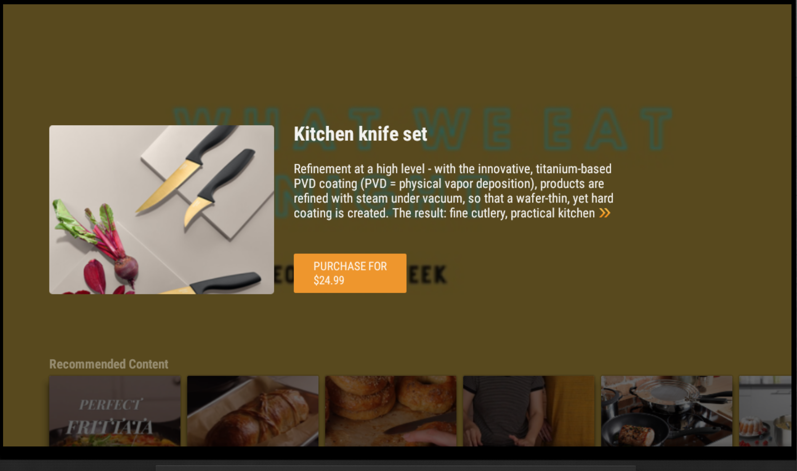
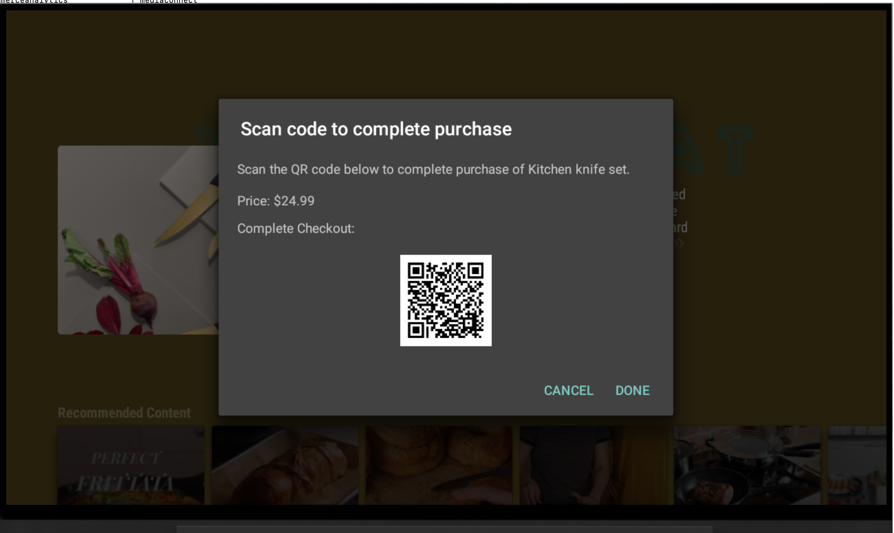
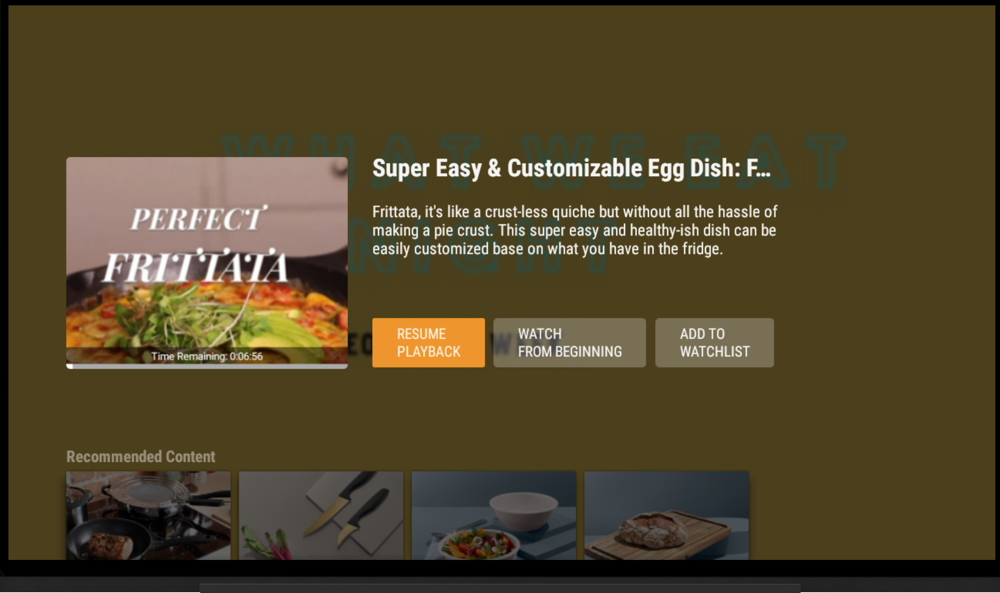
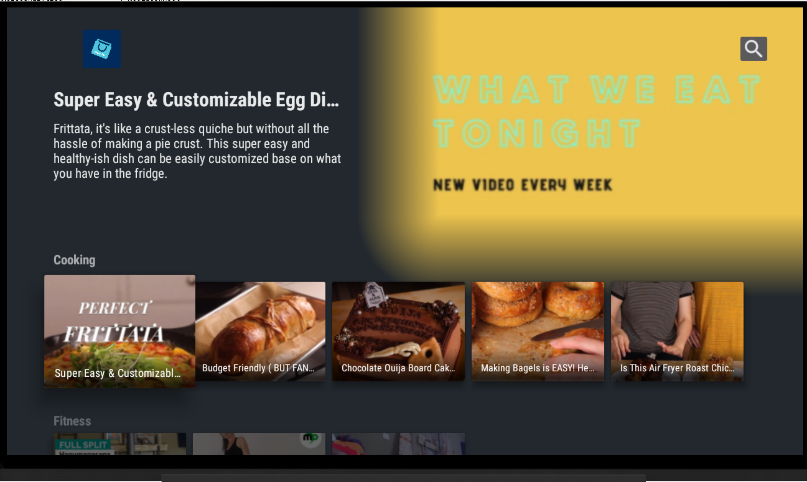
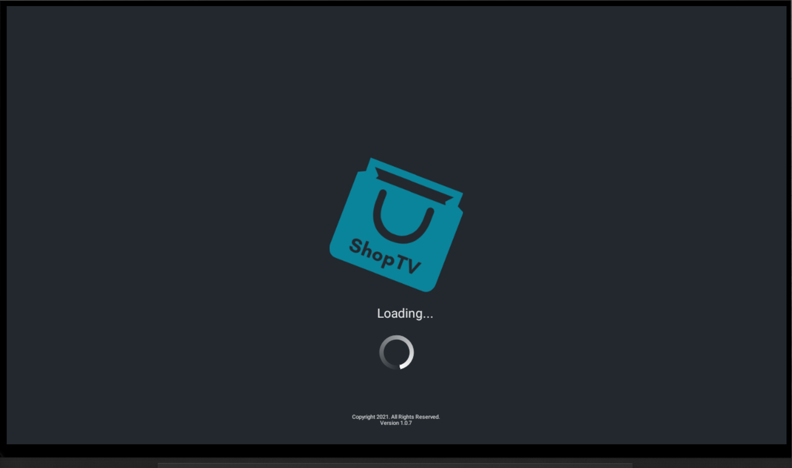

	

Shop TV
---

Shop TV

Built for the Tchibo customer experience hackathon.

### Concept

ShopTV is a FireTV (android based) app that can run on any public television or tablet display (for example, stores, gift shops, and malls, or at waiting/service areas).

Customers can engage with the television, watch videos, and scan and discover products right from the display. If the customer watches or engages with a piece of media and finds an item, the customer can simply scan the generated QR code from his or her mobile device and complete checkout away from the TV.

Each item has a distinct checkout link which allows the user to submit payment (and any necessary shipping information) from their personal mobile device. 
These links get rendered as QR codes that users can scan on the public display or tablet to view/complete checkout for that item.

Tchibo, for example, could plug into their existing network of shops and place displays that provide an engagement opportunity for the idle/browsing customer. Or if someone has ordered an item at a coffee shop, be able to optionally engage with a tablet running the app to drive additional purchases.

### To run
* Install Android Studio
* Build and run on an android / Fire TV Device
* For production, would require swapping out the fixed selection of items and connecting to a live catalog of items.

### Screenshots

